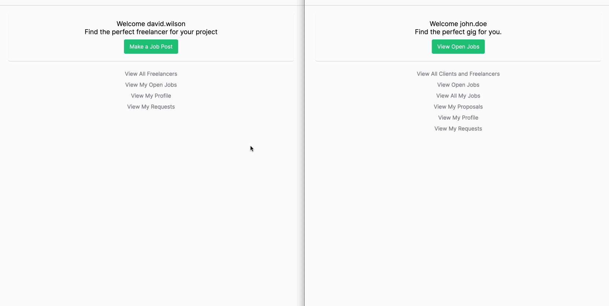

# Gig Link

## Overview

Gig Link is a full-stack web application that serves as a platform connecting freelancers and clients for project collaboration. Built using the MERN stack (**MongoDB**, **Express.js**, **React.js**, **Node.js**), **Redux**, **Redux Toolkit**, **RTK Query**, **react-router-dom**, and **Sass**, Gig Link provides a seamless and secure experience for users.

## Live Demo

Check out the live demo of the project [here](https://gig-link.onrender.com).

### Demo Credentials

To explore the features of Gig Link, you can use the following demo credentials:

**Client**

- Username: `guest.client`
- Password: `123123`

**Freelancer**

- Username: `guest.freelancer`
- Password: `123123`

**Admin**

- Username: `guest.admin`
- Password: `123123`

## Authentication Flow

Gig Link employs a secure authentication flow to ensure the privacy and authorization of its users. Here's a breakdown of the authentication process:

1. **Login**: Click on the "Login" button and enter your username and password. The entered password is compared to the hashed password stored in the database using the bcrypt library. Upon a successful match, a JSON Web Token (JWT) is generated, containing the necessary user information in its payload. This JWT is securely sent to the browser as a same-site and secure cookie. The JWT serves as authorization for executing authorized operations on the website.

2. **Sign Up**: Alternatively, users can click on "Sign Up" to create a new account. Provide a username, password, first name, last name, and select a role. After filling in the required information, click "Sign Up." If the provided credentials are valid, you will be redirected to the Login page, where you can log in with your newly created account.

3. **Dashboard**: After successfully logging in, users are directed to their respective dashboards, which contain operations specific to their roles.

## Security Highlights

Gig Link prioritizes the security of user data:

- **Password Hashing**: User passwords are securely hashed using bcrypt, ensuring they are never stored in plain text. This protects against unauthorized access and strengthens the platform's overall security.

- **JWT-based Authentication**: Gig Link utilizes JSON Web Tokens (JWT) for secure user authentication. JWTs are encrypted, digitally signed, and transmitted as secure, same-site cookies. This approach ensures data integrity, guards against tampering, and mitigates common web vulnerabilities like XSS and CSRF attacks.

## Single Page Application with Redux, Redux Toolkit, RTK Query, and react-router-dom

Gig Link utilizes a single page application (SPA) architecture to enhance the user experience, providing a seamless and responsive platform. This is made possible by leveraging the following technologies:

- **Redux**: Redux is employed as a state management library, allowing efficient handling of application-level state. It enables consistent and predictable data flow across components, ensuring a synchronized user interface.

- **Redux Toolkit**: Redux Toolkit simplifies the process of configuring Redux by providing a set of utilities and best practices.

- **RTK Query**: RTK Query is utilized for efficient data fetching and caching. It simplifies API integration by generating customizable hooks and automatically managing data caching and invalidation.

- **react-router-dom**: The react-router-dom library is employed for client-side routing within the SPA. It enables seamless navigation between different views or components without requiring a full page refresh. This enhances the user experience by providing smooth transitions and faster loading times.

## User Authentication with JWT Tokens

Gig Link implements a secure user authentication system using JWT (JSON Web Tokens). This ensures the persistence of the user's login state even after page refreshes. The following features highlight the usage of JWT tokens within the project:

- **Access and Refresh Tokens**: Gig Link issues an access token and a refresh token upon successful user authentication. The access token is used for authorization and is included in each authenticated API request. The refresh token is securely stored on the client-side and is used to obtain a new access token when the previous one expires.

- **Persisted Login State**: By leveraging JWT tokens, Gig Link ensures that users remain authenticated and their login state is persisted. This provides a seamless user experience as users navigate through different pages within the application.

## Role-Based Access Control and Permissions

Gig Link incorporates a role-based access control system to manage user permissions and protect sensitive routes and features. Certain routes within Gig Link are restricted based on the user's role and permissions. Access to these protected routes is granted only to authorized users, ensuring that sensitive functionality and data remain secure.

## Overview of User Operations

Gig Link offers a range of operations for each user's role:

**Client**

- Create and edit job posts

- Make job requests to freelancers

- Review and rate freelancers, and delete reviews

- Accept or decline proposals from freelancers
- Mark jobs as completed or cancelled

**Freelancer**

- View open job posts and make proposals
- Accept or decline job requests from clients

**Admin**

- Delete other users and jobs

**All Users**

- View and edit their own profiles

- Search for users by username
- Delete their own accounts
- Send messages to other users on the platform

